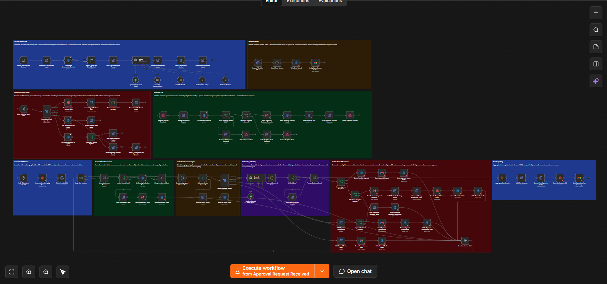
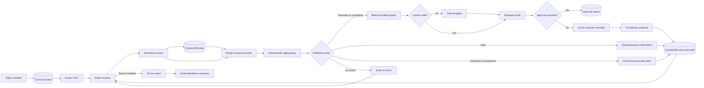

# n8n AI Invoice Collections Automation

[](https://github.com/gaboscini/n8n-ai-invoice-collections-automation/actions/workflows/validate.yml)
[](LICENSE)

An enterprise-style portfolio workflow that combines n8n, Amazon S3, Amazon DynamoDB, Amazon Bedrock, Gmail, deterministic collection policy, human approval, audit evidence, and operational error handling.

The repository uses fictional data and generic infrastructure names. It is an independent portfolio implementation and does not contain customer workflows, credentials, private endpoints, or proprietary datasets.

## Workflow overview



The single-canvas design keeps the conversational agent, governed data tools, scheduled collection pipeline, human approval, audit evidence, reporting, and error handling visible as one operational workflow.

## Executive summary

The workflow automates a controlled business-to-business invoice collection process:

1. A daily schedule downloads an invoice aging feed from Amazon S3.
2. n8n extracts and processes invoice records in bounded batches.
3. DynamoDB supplies the latest collection state for each invoice.
4. Deterministic rules select no action, customer reminder, escalation, payment confirmation, or manual review.
5. Amazon Bedrock drafts grounded reminder content only after policy selection.
6. Unsafe AI output is replaced with a deterministic template.
7. Low-risk reminders can continue to the configured email node; high-risk reminders enter human approval.
8. Gmail nodes handle customer reminders, confirmations, internal approvals, exceptions, completion summaries, and failure alerts.
9. DynamoDB records state, approvals, audits, and incidents.
10. S3 stores delivery evidence and run reports.

The same canvas also includes a conversational invoice-operations agent, self-referencing n8n tools, a one-time approval API, and workflow-level error handling.

## Why this workflow is portfolio-quality

The canvas demonstrates practical use of native n8n capabilities rather than hiding the implementation inside JavaScript:

| Capability | Implementation |
|---|---|
| File ingestion | Schedule Trigger, AWS S3, Extract From File |
| Batch processing | Loop Over Items |
| State retrieval | AWS DynamoDB Get operations |
| State and audit writes | AWS DynamoDB Insert operations |
| Data preparation | Edit Fields / Set nodes |
| Branching | If and Switch nodes |
| Multi-source combination | Merge node |
| AI orchestration | n8n AI Agent with Amazon Bedrock, bounded memory, durable session context, and governed tools |
| Controlled notifications | Gmail nodes for customer and internal events |
| Artifacts and reporting | Aggregate, Convert to File, and AWS S3 upload |
| Human approval | Webhook, exact-phrase check, recipient gate, one-time approval state |
| Failure operations | Error Trigger, redaction, incident storage, operations email |
| Visual documentation | Ten non-overlapping Sticky Note sections |

The generated export contains 104 nodes: 94 functional nodes and 10 background section notes. It uses 19 DynamoDB nodes, 4 S3 nodes, 8 Gmail nodes, and only 4 Code nodes.

## Why four Code nodes remain

Native n8n nodes are used wherever they clearly fit. JavaScript remains only where a native replacement would make the workflow less reliable or less understandable:

1. **Calculate Aging and Collection Rule** performs date arithmetic and a multi-factor collection decision in one auditable policy function.
2. **Parse and Screen AI Draft** extracts the subject and body, applies size limits, and rejects prohibited content.
3. **Filter and Summarize Portfolio** applies optional agent-provided filters and returns bounded, calculated portfolio results from the current S3 feed.
4. **Redact Error Context** removes token-like values and creates a bounded incident record before storage or notification.

No Code node simulates S3, DynamoDB, email, batching, merging, routing, reporting, or webhook responses.

## Repository contents

```text
.
|-- workflows/
|   `-- ai-invoice-collections-automation.json
|-- scripts/
|   |-- build-combined-workflow.mjs
|   `-- validate-workflow.mjs
|-- samples/
|   |-- fictional-invoices.json
|   |-- daily-invoice-aging.csv
|   |-- approval-request.json
|   `-- agent-demo-prompts.md
|-- docs/
|   |-- assets/
|   |   `-- workflow-overview.png
|   |-- ARCHITECTURE.md
|   |-- AWS_SETUP.md
|   |-- DEMO_GUIDE.md
|   |-- SECURITY.md
|   `-- TESTING.md
|-- .github/workflows/validate.yml
|-- package.json
`-- LICENSE
```

## Workflow architecture



### Conversational agent

The chat lane is deliberately separate from the scheduled automation. It combines a 12-turn memory window with a compact DynamoDB session record so follow-ups remain understandable across executions. The agent can call three governed tools:

- **Portfolio Search** reads the current S3 feed for totals, lists, comparisons, customer searches, owner searches, and aging filters.
- **Invoice State Lookup** retrieves current invoice state from DynamoDB.
- **Reminder Preview** verifies that an invoice is eligible and returns a preview without sending.

All three tools call the same imported workflow through one **Execute Workflow Trigger**. After import, replace the visible `REPLACE_WITH_THIS_WORKFLOW_ID` values with the imported workflow ID.

Conversation context resolves references such as “that invoice” or “the largest one,” but it is not treated as evidence for current amounts, status, eligibility, recipients, or approval. Those facts must be refreshed through a tool.

### Scheduled collections pipeline

The scheduled lane expects a CSV file at:

```text
s3://invoice-collections-portfolio-demo/incoming/daily-invoice-aging.csv
```

Each invoice is normalized, enriched with DynamoDB state, evaluated by deterministic policy, and routed to the appropriate branch. The workflow processes 25 records per batch.

### Collection policy

The demonstration policy is intentionally transparent:

| Condition | Result |
|---|---|
| Paid and confirmation not yet recorded | Payment confirmation |
| Disputed or exception status | Manual review |
| At least 60 days overdue or at least USD 25,000 | Internal escalation and human approval |
| Due within seven days or already overdue | Customer reminder |
| Anything else | No action, audited |

The AI model does not choose these outcomes.

### AI drafting and fallback

Amazon Bedrock receives only the approved invoice fields needed for a reminder. It is instructed not to add bank details, fees, penalties, legal claims, or unavailable facts.

The draft guard checks:

- subject and body presence;
- maximum lengths;
- placeholders;
- payment-routing language;
- unsupported penalties or legal-action language.

If the result fails, the workflow uses a deterministic reminder template.

### Email events

The workflow contains real n8n Gmail nodes for meaningful business events only:

- customer payment reminder;
- approval request for a high-risk reminder;
- approved customer reminder;
- payment confirmation;
- manual-review alert;
- daily operations summary;
- workflow-failure alert.

The public export is inactive and has no credentials. Static internal recipients use `example.com`, and the approval API blocks customer recipients outside `example.com`. Replace these controls only in a private environment with approved contacts, suppression rules, and governance.

### State and audit design

The example uses five generic DynamoDB tables:

| Table | Purpose | Suggested partition key |
|---|---|---|
| `invoice_collections_state_demo` | Current invoice collection state | `invoiceId` |
| `invoice_collections_approvals_demo` | Pending and consumed approvals | `approvalId` |
| `invoice_collections_audit_demo` | Immutable business events | `invoiceId`, with `eventAt` as sort key |
| `invoice_collections_incidents_demo` | Redacted workflow failures | `incidentId` |
| `invoice_collections_agent_sessions_demo` | Compact durable chat context | `sessionId` |

See [AWS setup](docs/AWS_SETUP.md) for the demonstration configuration.

## Human approval flow

High-risk reminders are queued instead of sent. The approval email contains an execution-bound phrase:

```text
APPROVE COLLECTION <invoiceId> <approvalId>
```

The approval webhook independently checks:

1. the approval exists;
2. its status is `PENDING`;
3. the full phrase matches exactly;
4. the recipient passes portfolio safety policy;
5. the approval is marked `USED` after delivery.

This is a demonstration pattern. A production version should also enforce expiry and conditional writes so concurrent requests cannot consume the same approval twice.

## Quick start

### Prerequisites

- n8n with the AWS, Gmail, and AI/LangChain nodes used by the export;
- Node.js 20 or later for static repository checks;
- a non-production AWS account if running S3, DynamoDB, or Bedrock tests;
- a non-production Gmail OAuth credential if testing notification nodes.

### Build and validate

```powershell
npm.cmd run build
npm.cmd test
```

The validator checks node types, connections, Code-node compilation, layout, generic infrastructure names, sample safety, secret patterns, and the absence of embedded credentials.

### Import into n8n

Import:

```text
workflows/ai-invoice-collections-automation.json
```

Keep the workflow inactive while configuring it.

### Configure the imported workflow

1. Select a non-production AWS credential on all S3, DynamoDB, and Bedrock nodes.
2. Select a non-production Gmail OAuth credential on all Gmail nodes.
3. Create the generic demonstration bucket and tables documented in `docs/AWS_SETUP.md`.
4. Upload `samples/daily-invoice-aging.csv` to the expected S3 key.
5. Replace all three self-workflow placeholders with the imported workflow ID.
6. Review all static recipients and the `example.com` recipient gate.
7. Execute individual branches manually before enabling the schedule or webhook.

## Demonstration sequence

1. Open the workflow and show the ten documented sections.
2. Run the S3 intake with the fictional CSV.
3. Show DynamoDB enrichment and deterministic action routing.
4. Compare an AI draft with the safe fallback branch.
5. Show the customer-reminder, payment-confirmation, and manual-review Gmail nodes.
6. Demonstrate that high-risk reminders enter the approval queue.
7. Submit an incorrect approval phrase, then a correct phrase using fictional data.
8. Show the S3 evidence file, DynamoDB audit item, run report, and operations summary.
9. Trigger a controlled failure and show redaction before incident storage and notification.
10. Ask the conversational agent for a portfolio summary, continue with a contextual follow-up, and then request the exact operational state of one invoice.

The Error Trigger lane is kept on the integrated canvas for portfolio readability. To execute it in n8n, duplicate that lane into a separate workflow and configure it as the main workflow's error workflow; an Error Trigger cannot catch failures from its own containing workflow.

See [Demonstration Guide](docs/DEMO_GUIDE.md) for the detailed walkthrough.

## Security and portfolio boundaries

Included controls:

- inactive export;
- no embedded credentials or private endpoints;
- fictional data and `example.com` recipients;
- deterministic financial and collection policy;
- bounded conversational memory;
- grounded model prompts;
- AI-output screening and safe fallback;
- exact human approval;
- recipient restriction;
- structured state and audit storage;
- failure redaction before storage and email.

Not claimed:

- deployed AWS infrastructure;
- completed n8n runtime tests;
- production-grade email suppression or consent management;
- atomic approval consumption;
- authenticated or tenant-aware webhook ingress;
- regulatory or legal approval for collection language;
- production monitoring, backup, retention, or disaster recovery.

The repository demonstrates design and static validation. Runtime behavior must be verified in the reviewer’s own non-production n8n and AWS environment.

## Current validation status

Static build and validation pass locally. The generated export contains one integrated workflow, 104 valid nodes, 10 background notes, 4 Code nodes, resolved connections, increased title spacing, no functional overlaps, no embedded credentials, and no detected proprietary identifiers or likely secrets.

Runtime import and scenario execution remain intentionally unverified until configured in an actual n8n workspace.

## Author

gaboscini<br>
AI automation, cloud solution design, and enterprise workflow engineering
