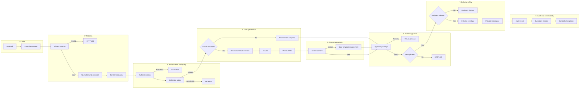

# n8n AI Invoice Collections Automation

An enterprise-style n8n portfolio project that demonstrates controlled invoice follow-up automation using deterministic financial rules, optional Claude-assisted drafting, explicit human approval, delivery safeguards, structured audit output, and a separate error-handling workflow.

This repository is an independently created technical demonstration. It uses fictional organizations, users, customers, invoices, addresses, and execution data. It is not copied from, connected to, or derived from an employer or client system.

> **Portfolio safety:** The public workflow does not send email. It simulates the provider handoff and returns the audit evidence that a production integration would persist.

## Executive summary

Accounts Receivable teams often repeat the same operational steps:

1. confirm that invoice data is complete and trustworthy;
2. determine whether the invoice is actually eligible for follow-up;
3. choose an appropriate reminder stage and tone;
4. draft a customer-facing message;
5. obtain approval for external communication;
6. send through an approved provider;
7. retain enough evidence to explain what happened;
8. alert operations when the automation fails.

This project models those responsibilities as explicit n8n stages. AI is intentionally limited to language drafting. Payment status, days overdue, authorization, eligibility, risk score, approval, recipient policy, and delivery state remain deterministic and inspectable.

The result is not presented as a production-ready collections platform. It is a reference implementation showing how production concerns can be represented honestly in an automation workflow without hiding critical decisions inside an LLM prompt.

## What this project demonstrates

### Workflow engineering

- Webhook contract design and correlation identifiers
- Defensive schema validation and payload-size controls
- Data normalization, minimization, and bounded strings
- Deterministic authorization and collection-policy decisions
- Explainable invoice eligibility and risk scoring
- Branch-specific HTTP responses
- A separate n8n Error Trigger workflow
- Readable canvas layout with colored process documentation

### Applied AI controls

- Claude used only for customer-facing language generation
- Grounding with a restricted set of approved invoice facts
- Low-temperature, bounded generation
- JSON-only output contract
- Post-generation content screening
- Deterministic fallback when AI is disabled or unsafe
- No AI authority over payment, eligibility, escalation, or delivery

### Enterprise delivery controls

- Actor-role authorization
- Explicit preview-versus-send separation
- Exact invoice-bound approval phrase
- Recipient-domain allow-list in public safety mode
- Idempotency metadata for downstream enforcement
- Structured audit events and execution metrics
- Redaction before incident classification and alert preparation
- Credential-free, inactive public exports
- Continuous integration that rebuilds and validates exports on every push and pull request

## Repository contents

```text
n8n-ai-invoice-collections-automation/
|-- README.md
|-- LICENSE
|-- package.json
|-- .env.example
|-- .gitignore
|-- .gitattributes
|-- .github/
|   `-- workflows/validate.yml
|-- workflows/
|   |-- ai-invoice-collections-automation.json
|   `-- execution-error-handler.json
|-- samples/
|   |-- preview-request.json
|   |-- approved-send-request.json
|   |-- invalid-request.json
|   `-- paid-invoice-request.json
|-- scripts/
|   |-- build-workflow.mjs
|   `-- validate-workflow.mjs
`-- docs/
    |-- ARCHITECTURE.md
    |-- TESTING.md
    |-- DEMO_GUIDE.md
    `-- SECURITY.md
```

## Workflow portfolio

### 1. Invoice collections orchestration

`workflows/ai-invoice-collections-automation.json`

The main workflow accepts a request to preview or simulate an approved invoice reminder. It is divided into eight documented processes:

| Process | Responsibility | Main controls |
|---|---|---|
| 1. Request intake | Establish execution context | Correlation ID, request ID, version, safety mode |
| 2. Contract validation | Reject untrusted input | Required fields, size, dates, amount, email, roles |
| 3. Authorization and policy | Decide whether action is allowed | Role permissions, status exclusions, aging, threshold, currency |
| 4. Draft generation | Produce reminder language | Deterministic template or grounded Claude request |
| 5. Content assurance | Treat AI output as untrusted | Length, placeholders, invoice reference, payment details, escalation language |
| 6. Human approval | Separate preview from action | Exact invoice-bound phrase and prior actor authorization |
| 7. Delivery safety | Prevent accidental communication | Fictional-domain allow-list and simulated provider |
| 8. Audit and observability | Return operational evidence | Actor, decision, risk, approval, source, duration, correlation |

### 2. Execution error handling

`workflows/execution-error-handler.json`

The supporting workflow uses n8n's Error Trigger to model a controlled operational response:

1. capture failed execution metadata;
2. redact email addresses and credential-like values;
3. classify severity and retry guidance deterministically;
4. construct a minimal alert payload;
5. return an audit-friendly incident record.

The public export simulates alert delivery. Production implementations should connect an approved service such as Microsoft Teams, Slack, PagerDuty, or an enterprise incident platform only after governance and credential controls are established.

## Architecture



See [Architecture and Design Decisions](docs/ARCHITECTURE.md) for trust boundaries, decision ownership, idempotency limitations, and the production-hardening plan.

## Business rules

### Role permissions

| Role | Preview | Simulated send |
|---|---:|---:|
| `ar_analyst` | Yes | No |
| `ar_manager` | Yes | Yes, with exact approval |
| `finance_admin` | Yes | Yes, with exact approval |

### Invoice exclusions

No reminder is prepared when any of the following applies:

- status is `PAID`, `SETTLED`, `CLOSED`, or `VOID`;
- status or dispute status is `DISPUTED` or `ON_HOLD`;
- the invoice is not overdue;
- the currency is outside the configured policy;
- the amount is below the configured minimum.

### Demonstration aging policy

| Days overdue | Stage | Tone | Base risk score |
|---:|---|---|---:|
| 0 | Current | Informational | 0 |
| 1–14 | Early follow-up | Friendly | 15 |
| 15–30 | Payment reminder | Professional | 30 |
| 31–60 | Manager review | Firm | 50 |
| 61+ | Legal review | Firm | 70 |

Risk adds 10 points for invoices of at least 10,000 and 20 points for invoices of at least 50,000, capped at 100.

These thresholds are portfolio assumptions. They are not legal, accounting, or credit-control advice and should not be reused without business approval.

## Why AI does not make the collection decision

Large language models are useful for tone, clarity, summarization, and drafting. They are not the authoritative source for whether an invoice is paid, disputed, overdue, eligible, or approved for communication.

This workflow therefore separates responsibilities:

| Decision | Owner |
|---|---|
| Invoice facts | Supplied business record |
| Days overdue | Deterministic date calculation |
| Eligibility | Deterministic collection policy |
| Actor permission | Deterministic role policy |
| Risk score | Deterministic rules |
| Reminder language | Template or Claude |
| Content acceptance | Deterministic screen plus human review |
| Send approval | Authorized human |
| Delivery result | Approved provider adapter |

This design keeps business decisions explainable and limits the cost of an incorrect or malformed AI response.

## AI grounding and content assurance

Claude receives only:

- invoice number;
- customer name;
- amount and currency;
- due date;
- calculated days overdue;
- approved stage and tone.

The model is explicitly prohibited from inventing:

- bank details or payment instructions;
- customer contacts;
- penalties, interest, or fees;
- payment plans or promises;
- legal consequences;
- dates that were not provided.

After generation, the workflow checks:

- subject and body are present;
- length limits are respected;
- invoice number remains present;
- no unresolved template placeholders exist;
- no bank-account or routing language appears;
- legal escalation language appears only at the legal-review stage.

If the response is missing, malformed, or fails screening, it is discarded and replaced by the deterministic template.

## Request contract

### Required top-level fields

| Field | Type | Purpose |
|---|---|---|
| `requestId` | string | Correlation and operational traceability |
| `action` | `preview` or `send` | Requested workflow behavior |
| `actor` | object | User identity and role used for authorization |
| `invoice` | object | Invoice and customer facts |

### Optional fields

| Field | Type | Default |
|---|---|---|
| `useAi` | boolean | `false` |
| `approvalPhrase` | string | empty |
| `asOfDate` | `YYYY-MM-DD` | current UTC date |
| `policy.minimumAmount` | number | `25` |
| `policy.allowedCurrencies` | string array | demonstration currency list |
| `policy.demoRecipientDomain` | string | `example.com` |

### Example preview request

```json
{
  "requestId": "demo-preview-001",
  "action": "preview",
  "useAi": false,
  "asOfDate": "2026-09-19",
  "actor": {
    "userId": "analyst-demo-01",
    "role": "ar_analyst"
  },
  "invoice": {
    "invoiceId": "INV-DEMO-1042",
    "customerId": "CUS-DEMO-204",
    "customerName": "Northstar Office Supply",
    "customerEmail": "accounts.payable@example.com",
    "amount": 18450,
    "currency": "USD",
    "dueDate": "2026-08-05",
    "status": "OPEN",
    "disputeStatus": "NONE"
  }
}
```

## Response patterns

| HTTP status | Workflow status | Meaning |
|---:|---|---|
| 200 | `preview_ready` | Draft and approval instruction returned |
| 200 | `no_action` | Policy excluded the invoice |
| 200 | `simulated_sent` | Approval passed and provider simulation completed |
| 400 | `validation_failed` | Contract rejected before policy or AI |
| 403 | `forbidden` | Actor cannot perform the action |
| 403 | `recipient_blocked` | Recipient is outside the public demonstration allow-list |
| 409 | `approval_required` | Exact invoice-bound approval phrase missing |

## Quick start

### Prerequisites

- An n8n environment used only for testing or portfolio development
- Node.js 20 or later for repository validation
- Optional Anthropic API access if testing the Claude branch

### 1. Build and validate exports

```powershell
npm run build
npm test
```

The test suite verifies:

- both workflow files parse;
- every Code node compiles;
- every connection resolves to an existing node;
- required enterprise control stages are present;
- the main workflow includes at least eight process notes;
- functional nodes do not overlap;
- exports are inactive;
- no credential object or likely secret is embedded.

The included GitHub Actions workflow repeats the build and validation on every push and pull request, and fails if generated exports are not committed consistently.

### 2. Import into n8n

Import both files:

1. `workflows/ai-invoice-collections-automation.json`
2. `workflows/execution-error-handler.json`

Keep both inactive until the test scenarios pass.

### 3. Test without Claude

Start the main workflow in test mode, copy its test webhook URL, and send the preview sample:

```powershell
$body = Get-Content -Raw ".\samples\preview-request.json"

Invoke-RestMethod `
  -Method Post `
  -Uri "PASTE_TEST_WEBHOOK_URL_HERE" `
  -ContentType "application/json" `
  -Body $body
```

Expected behavior:

- validation succeeds;
- the deterministic policy classifies the invoice;
- the template branch runs;
- a preview and approval phrase are returned;
- no external email is sent.

### 4. Configure Claude optionally

Create an n8n **Header Auth** credential using:

- Header name: `x-api-key`
- Header value: your Anthropic API key

Assign it to **Generate Claude Draft**. Never paste the key into the workflow JSON, a Code node, a screenshot, or source control.

Set `useAi` to `true` and repeat the preview test. Review the content-screening output and draft source.

### 5. Test human approval

Run the approved sample:

```powershell
$body = Get-Content -Raw ".\samples\approved-send-request.json"

Invoke-RestMethod `
  -Method Post `
  -Uri "PASTE_TEST_WEBHOOK_URL_HERE" `
  -ContentType "application/json" `
  -Body $body
```

Expected status: `simulated_sent`.

The result must explicitly say that no external email was sent.

## Test matrix

| Scenario | Sample or change | Expected path |
|---|---|---|
| Valid preview | `preview-request.json` | Template → preview |
| AI preview | Preview sample with `useAi: true` | Claude → screening → preview |
| Authorized send | `approved-send-request.json` | Approval → allow-list → simulation → audit |
| Analyst attempts send | Change approved sample role to `ar_analyst` | HTTP 403 authorization |
| Incorrect approval | Change one character in `approvalPhrase` | HTTP 409 |
| Invalid contract | `invalid-request.json` | HTTP 400 before policy and AI |
| Paid invoice | `paid-invoice-request.json` | No-action policy result |
| Disputed invoice | Set `disputeStatus: DISPUTED` | No-action policy result |
| Below threshold | Set amount below `minimumAmount` | No-action policy result |
| Recipient outside allow-list | Use a non-`example.com` address during send | HTTP 403 recipient block |
| Unsafe AI text | Pin a response containing placeholders or bank details | Deterministic replacement |
| Workflow execution error | Trigger a controlled node failure | Error workflow redacts and classifies |

See [Testing](docs/TESTING.md) for the detailed validation procedure.

## Security model

### Included controls

- inactive exports;
- no embedded credential objects;
- request-size limit;
- input validation and bounded values;
- role-based action authorization;
- deterministic policy decisions;
- content screening;
- human approval;
- recipient allow-list;
- redaction in the error workflow;
- simulated external actions;
- correlation and audit metadata.

### Deliberately excluded from the public demo

- customer or employee data;
- company domains and identifiers;
- production webhooks;
- email-provider credentials;
- live message delivery;
- durable approval or idempotency storage;
- tenant authentication;
- internal prompts or business policy;
- cloud infrastructure configuration.

See [Security Notes](docs/SECURITY.md).

## Idempotency and replay protection

The main workflow emits an idempotency key composed from:

- invoice ID;
- action;
- evaluation date;
- actor ID.

This makes intended duplicate detection visible to downstream systems. The public demo does not claim to enforce uniqueness because that requires a durable, atomic store.

A production design should reserve the key before delivery using a transactional database or an equivalent strongly consistent mechanism, reject duplicates, and record the provider result against the same key.

## Observability

The successful simulated-send response includes:

- correlation ID;
- idempotency key;
- simulated provider result;
- actor ID and role;
- invoice and customer identifiers;
- collection stage and risk score;
- approval result;
- draft source;
- recipient domain rather than full address;
- execution duration;
- AI-use indicator.

The error workflow returns:

- incident ID;
- workflow and execution identifiers;
- last executed node;
- redacted error message;
- severity;
- retry recommendation;
- simulated alert payload.

## Production hardening roadmap

Before using this design with real customers, implement and validate:

### Identity and access

- authenticated webhook ingress;
- tenant isolation and server-controlled actor identity;
- centrally managed role permissions;
- short-lived authorization for external actions;
- separation of duties for high-risk collection stages.

### Data and state

- durable, expiring, one-time approval records;
- atomic idempotency enforcement;
- authoritative invoice lookup instead of trusting supplied status;
- immutable audit storage;
- retention, deletion, and regional data-residency controls.

### Delivery

- approved email provider;
- recipient suppression and consent checks;
- bounced-address and complaint handling;
- delivery-status reconciliation;
- rate limits and customer-level communication frequency controls.

### AI governance

- approved model and region;
- prompt and model versioning;
- token and cost monitoring;
- evaluation dataset and regression tests;
- human review policies by stage and risk;
- content retention and provider privacy review.

### Reliability

- gateway payload and request-rate limits;
- queue-based delivery isolation;
- retries with backoff only for safe operations;
- circuit breaking and provider timeout policy;
- centralized logs, metrics, traces, and alerts;
- recovery procedures and dead-letter handling.

### Business governance

- approved aging thresholds and communication templates;
- jurisdiction-specific legal review;
- dispute and hardship handling;
- documented ownership for policy changes;
- measurable operational success criteria.

## Design trade-offs

### Why a webhook instead of a schedule?

The workflow demonstrates a reusable orchestration contract that can be called by a CRM, finance system, portal, or scheduled upstream process. A production solution could add a scheduler, but data retrieval and authorization would still need an authoritative system boundary.

### Why include a deterministic template?

It keeps the workflow testable without AI credentials, provides continuity during model failure, and creates a known-safe replacement when generated content fails screening.

### Why simulate delivery?

A public repository should be safe to import. Real email delivery would require credentials, recipient governance, suppression rules, provider error handling, and potentially sensitive execution evidence. Simulation demonstrates the control flow without encouraging unsafe use.

### Why not call the workflow “fully production-ready”?

The repository intentionally lacks durable approval storage, atomic idempotency, authoritative invoice retrieval, tenant authentication, live delivery, and centralized monitoring. Calling it production-ready would hide material gaps. The project instead demonstrates how those boundaries should be documented and where they belong.

## Demonstration guidance

A strong five-minute walkthrough should show:

1. the eight colored process areas on the main canvas;
2. validation stopping malformed input before AI;
3. deterministic policy excluding a paid invoice;
4. template and Claude drafting modes;
5. content screening and fallback;
6. exact approval rejection and acceptance;
7. recipient allow-list protection;
8. audit and metrics output;
9. the separate redacted error-handling workflow;
10. honest production-hardening boundaries.

See [Demonstration Guide](docs/DEMO_GUIDE.md).

## Current validation status

Repository-level checks validate workflow structure, JavaScript compilation, connections, notes, layout spacing, inactive status, and credential safety.

Runtime evidence must be added only after the workflows are imported into an actual n8n workspace and the scenarios are executed. This repository intentionally distinguishes static validation from observed runtime behavior.

## Author

Built by Gabrielle Faurillo as an independent n8n and AI automation portfolio project.
