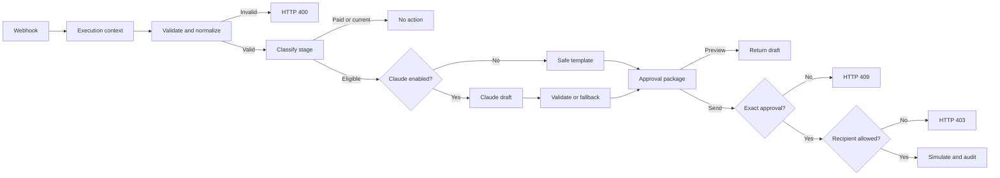

# Architecture and Design Decisions

## Scope

This repository contains a generic portfolio architecture for controlled business-to-business invoice follow-up. The main workflow accepts one invoice request, validates and minimizes it, authorizes the requested action, applies deterministic collection policy, optionally asks Claude to draft customer-facing language, screens generated content, requires explicit approval, applies a recipient policy, and produces audit evidence. A separate Error Trigger workflow redacts and classifies failed executions.

It is intentionally not a billing platform, accounting system, or autonomous debt-collection service.

## Processing model

## Trust boundaries

1. **Untrusted request:** Every webhook field is treated as untrusted and length-bounded.
2. **Deterministic policy:** Eligibility, stage, and tone are decided without an LLM.
3. **Constrained generation:** Claude receives only approved invoice facts and must return two JSON strings.
4. **Output validation:** Invalid AI output is discarded and replaced by a deterministic template.
5. **Human authorization:** A send request requires an exact invoice-bound approval phrase.
6. **Public safety mode:** The public workflow never sends external email.
7. **Operational isolation:** Failed executions are routed to a separate redaction and incident-classification workflow.

## Authorization boundary

Preview and send are separate actions. Analysts can request drafts, while manager and finance-administrator roles can request an approved send. The role supplied by this public demo is untrusted input; production identity must be asserted by an authenticated upstream service and must never rely on a user-editable request body.

## Recipient boundary

The public workflow allows simulated send actions only for the configured fictional domain. This protects reviewers from accidentally directing the imported workflow toward a real person. Production delivery requires an authoritative contact source, suppression controls, consent rules, and provider reconciliation.

## Idempotency

The workflow emits an `idempotencyKey` derived from invoice ID, action, evaluation date, and actor ID. A production implementation should enforce uniqueness in a durable database before delivery. The public workflow exposes the key for demonstration but does not pretend that stateless n8n execution provides an atomic guarantee.

## AI boundary

The model drafts language only. It does not determine whether an invoice is overdue, choose a collection stage, approve delivery, calculate amounts, or invent payment instructions. A deterministic fallback keeps the workflow usable when the model is disabled, unavailable, or returns malformed output.

## Failure handling

The supporting workflow starts with n8n's Error Trigger. It redacts common email and credential patterns before assigning severity or constructing an alert. Severity remains deterministic. Alert delivery is simulated so that importing the repository cannot disclose execution data to an external service.

## Data classification

All samples are marked as fictional demonstration data. Runtime execution screenshots should be reviewed separately because n8n can display request headers, credential names, webhook URLs, and node outputs even when the exported workflow is sanitized.

## Production hardening

Before production use, add:

- authenticated webhook ingress and tenant authorization;
- a durable approval record with expiry and one-time consumption;
- an atomic idempotency store;
- an approved email provider and recipient allow-list;
- centralized secrets management;
- structured monitoring, alerting, retention, and redaction;
- rate limits, replay protection, and payload-size limits at the gateway;
- legal review of reminder policies and regional communications requirements.
